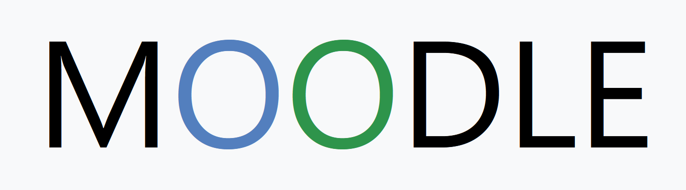
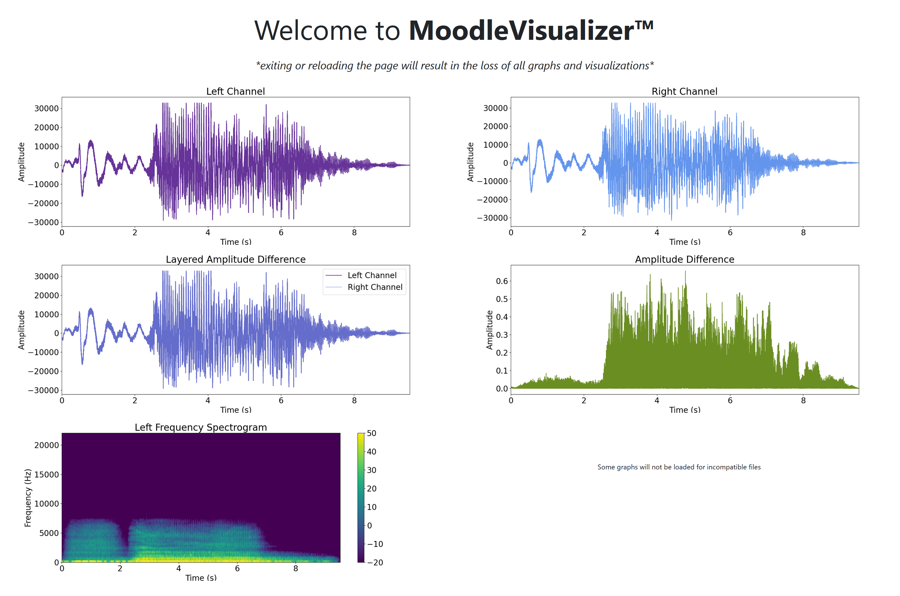

 

  

  <h3 align="center">Moodle</h3>

  

    An interactive Audio Visualizer!
     
    <a href="https://github.com/othneildrew/Best-README-Template"><strong>Explore the docs »</strong></a>
     
     
    <a href="TODO">View Demo</a>
    ·
    <a href="TODO">Clone</a>
  

<!-- TABLE OF CONTENTS -->

  
Table of Contents

  <ol>
    <li>
      <a href="#about-the-project">About The Project</a>
      <ul>
        <li><a href="#built-with">Built With</a></li>
      </ul>
    </li>
    <li><a href="#usage">Usage</a></li>
    <li><a href="#roadmap">Roadmap</a></li>
    <li><a href="#contributing">Contributing</a></li>
    <li><a href="#license">License</a></li>
    <li><a href="#acknowledgments">Acknowledgments</a></li>
  </ol>

<!-- ABOUT THE PROJECT -->
## About The Project

  

Welcome! Moodle is a web app for visualizing and analyzing sound data. Manually using matplotlib to generate graphs for audio analysis can be tedious, but with Moodle it's a breeze!

How to:
* Navigate to the Upload tab
* Upload your WAV file
* Get your graphs :smile:

To try Moodle out, run the program locally!

(<a href="#readme-top">back to top</a>)

### Built With

* Flask
* MatPlotLib
* Wave
* Numpy
* Jinja
* Bootstrap
* Pydub
* And More!

(<a href="#readme-top">back to top</a>)

<!-- USAGE EXAMPLES -->
## Usage

# Front End
The Front End is built using flask and bootstrap. Some aspects of the program, including the bootstrap navigation bar, were inspired by the CS50x week Nine Finance Project. The Frontend design, in which each html page is an extension of the original layout, was also influenced by the Finance Project. Since CS50x introduced me to Jinja, it felt fitting to utilize it in this project. Thus, most of Moodle's pages incorporate Jinja. Moodle's Homepage (index.html) opens with a brief description of the web app and its uses. Below the text are some example graphs from the program.
Users can easily Navigate to the MoodleVisualizer through the navigation bar. By clicking on the Upload tab, users are directed to the upload page (upload.html). There, users upload their audio file through a html form. This form is very similar to the buy and sell forms from the Finance Project. The uploaded files are then processed, which will be discussed later.

Finally, the User enters the MoodleVisualizer. There, they are greeted with up to five different graphs:

* The _Left Amplitude Graph_ displays the Left Amplitude of the audio file. The user can see the audio's waveforms, similar to what can be seen in a sound editing software. However, Moodle provides more detail, explicitly stating the amplitude range and time range.
* The _Right Amplitude Graph_ is very similar to the Left Amplitude Graph. The reason there are two is to visualize the difference between the Left and Right Channels. Most audio files are stereo files, meaning there are two channels (typically left and right). Showing the individual mono channels, a feature not provided by most audio editors, on different graphs enables closer analysis of the audio.
* The _Layered Amplitude Graph_ allows for even closer analysis of the channel differences. This graph shows the typical visualization of an audio file's waveform. The different colors for the left and right channels, which correspond to the colors on the Left and Right Amplitude Graphs, allow for in-depth analysis of the waveforms that would be difficult on separate maps.
* The _Amplitude Difference Graph_ furthers the analysis between channel differences. Visualizing the proportional difference between the left and right channels at each second, this graph provides specific details and numbers that are difficult to interpret from the other amplitude graphs.
* The _Spectrogram_ displays the frequency of the audio file throughout its duration. This visualization allows for frequency analysis that would be otherwise difficult. The graph's use of color also makes it very interesting to display.

All _graphs_ are created using MatPlotLib's pyplot and can be saved by the user. Instead of directly rendering each graph onto the page, Moodle saves each image as a png into the program's static folder. In the Visualizer page, the program retrieves the images and displays them to the screen. Due to the diversity of settings for audio files (even for just WAV files), some files' settings may not be compatible with Moodle. In that case, fewer graphs may be generated. To facilitate this dynamic change, Moodle uses Jinja to place the images on the screen.

For _CSS_, Moodle utilizes bootstrap to create its graphics. Some key examples include the navigation bar and the form submission on the upload page. Other simple style settings are stored in the styles.css file.

# Back End
All of Moodle's backend is contained within the app.py file. Just to recap, Moodle uses flask, wave, numpy, pydub, and matplotlib. At the top of the app.py document, there are several unusual statements. The first is matplotlib.use('Agg') and the second is under the app declaration. These were solutions to a Tkinter problem I encountered while using Matplotlib. For some reason, tkinter would print debug pings to the console for every single font it tried to load. As you can imagine, it was quite messy. After searching the matplotlib API and Stack Overflow, I finally settled on these two solutions (which I have been afraid to touch ever since).

The backend for the _Homepage's_  only primary function is in clearing the cache and previous graphs and audio files from the user. As a reminder, Moodle saves its graphs to a png before uploading it to the visualizer. To prevent cluttering the static folder, both the homepage and upload page call media_clear(). This function uses os.remove() to delete the graphs and audio files. It also clears the session["audio_file_path"], which Moodle uses as a cache to communicate the audio file path from the upload page to the visualizer.
Some other functions created for the program include allowed_filetypes() and check_wav(), which both use string manipulation to check for the datatype of the uploaded file. Moodle also uses the save_visual() function, which will be further discussed in the next section.

The backend for the _Upload Page_ ensures the file is of the correct type before sending it to the visualizer for processing. As of right now, the program only accepts WAV files. This decision was made due to the complexity and diversity of python's many audio manipulation libraries. Moodle utilizes the wave library which, as its name suggests, is used to manipulate WAV files. Once the user uploads the file, the program first checks the file's integrity, ensuring it has acceptable naming conventions and is of an allowed type. The wav file handleis stored in the file path cookie (see homepage backend). Any errors or incorrect file types direct the user back to the upload page.

The _Visualizer_ page's backend is the heart of Moodle's program. Here, the uploaded and cleaned file is analyzed using numpy and the wave library. The frequency, total number of samples, duration, array of all amplitudes, number of channels, and amplitudes for each file is determined. Then, these values are plotted on graphs that are then displayed to the user. As explained previously, the diversity of settings within even just wav files means that some files do not contain enough data for some of the graphs. Therefore, try except blocks are implemented to prevent the program from crashing.

Moodle also uses the _flash function_ to alert the user of their file's upload status. In later implementations, the flash feature will be expanded upon so error messages flash red.

(<a href="#readme-top">back to top</a>)

<!-- ROADMAP -->
## Roadmap

- [x] Incorperate Example Graphs
- [ ] Compare Graphs side-by-sde
- [ ] Incorperate Generated Sound
- [ ] Visual Features
    - [ ] Red Flash

(<a href="#readme-top">back to top</a>)

<!-- LICENSE -->
## License

Under Progress. See `LICENSE.txt` for more information.

(<a href="#readme-top">back to top</a>)

<!-- ACKNOWLEDGMENTS -->
## Acknowledgments

* [An Amazing README template](https://github.com/jiaaro/pydub?tab=readme-ov-file#installation)

(<a href="#readme-top">back to top</a>)

